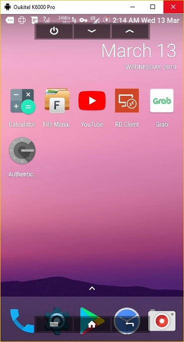
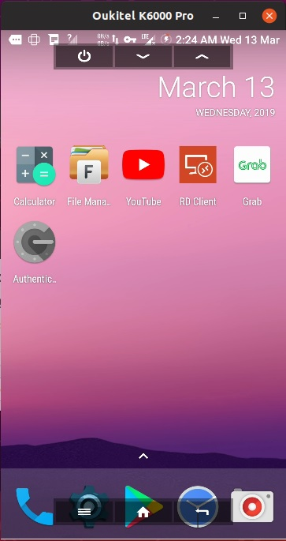

MirallDroid is a fork based on SCRCPY available https://github.com/Genymobile/scrcpy

# miralldroid (v1.0)

This application provides display and control of Android devices connected on
USB (or over TCP/IP). It does not require any _root_ access.
It works on _GNU/Linux_, _Windows_ and _MacOS_.

 


## Requirements

The Android part requires at least API 21 (Android 5.0).

Make sure you [enabled adb debugging][enable-adb] on your device(s).

[enable-adb]: https://developer.android.com/studio/command-line/adb.html#Enabling

On some devices, you also need to enable [an additional option][control] to
control it using keyboard and mouse.

[control]: https://github.com/Genymobile/scrcpy/issues/70#issuecomment-373286323


## Get the app


### Linux

On Linux, you typically need to [build the app manually][BUILD]. Don't worry,
it's not that hard.


### Windows

For Windows, for simplicity, prebuilt archives with all the dependencies
(including `adb`) are available:

 - [`miralldroid-win64-v1.0.zip`][direct-win64]
   _(SHA-256: a6354c9b3814c9dc734f720b83948c495e0e7afe378a867a870393d14f1b4392)_
 - [`miralldroid-win32-v1.0.zip`][direct-win32]  
   _(SHA-256: 44d58bc982c5f551686c39c565b5ba49b7246690e1f8fa505ec8086f3d8035db)_

[direct-win64]: https://github.com/DANIELVISPOBLOG/miralldroid/releases/download/v1.0/miralldroid-win64-v1.0.zip
[direct-win32]: https://github.com/DANIELVISPOBLOG/miralldroid/releases/download/v1.0/miralldroid-win32-v1.0.zip

You can also [build the app manually][BUILD].


## Run

Plug an Android device, and execute:

```bash
miralldroid
```

It accepts command-line arguments, listed by:

```bash
miralldroid --help
```

## Features


### Reduce size

Sometimes, it is useful to mirror an Android device at a lower definition to
increase performances.

To limit both width and height to some value (e.g. 1024):

```bash
miralldroid --max-size 1024
miralldroid -m 1024  # short version
```

The other dimension is computed to that the device aspect-ratio is preserved.
That way, a device in 1920×1080 will be mirrored at 1024×576.


### Change bit-rate

The default bit-rate is 8Mbps. To change the video bitrate (e.g. to 2Mbps):

```bash
miralldroid --bit-rate 2M
miralldroid -b 2M  # short version
```


### Crop

The device screen may be cropped to mirror only part of the screen.

This is useful for example to mirror only 1 eye of the Oculus Go:

```bash
miralldroid --crop 1224:1440:0:0   # 1224x1440 at offset (0,0)
miralldroid -c 1224:1440:0:0       # short version
```

If `--max-size` is also specified, resizing is applied after cropping.


### Wireless

_Miralldroid_ uses `adb` to communicate with the device, and `adb` can [connect] to a
device over TCP/IP:

1. Connect the device to the same Wi-Fi as your computer.
2. Get your device IP address (in Settings → About phone → Status).
3. Enable adb over TCP/IP on your device: `adb tcpip 5555`.
4. Unplug your device.
5. Connect to your device: `adb connect DEVICE_IP:5555` _(replace `DEVICE_IP`)_.
6. Run `miralldroid` as usual.

It may be useful to decrease the bit-rate and the definition:

```bash
miralldroid --bit-rate 2M --max-size 800
miralldroid -b2M -m800  # short version
```

[connect]: https://developer.android.com/studio/command-line/adb.html#wireless


### Record screen

It is possible to record the screen while mirroring:

```bash
miralldroid --record file.mp4
miralldroid --record file.mkv
miralldroid -r file.mp4
miralldroid -r file.mkv
```

2 Video file formats are accepted: Matroska (MKV) or MP4. If no valid extension
specified, MP4 will be the video file format by default.

"Skipped frames" are recorded, even if they are not displayed in real time (for
performance reasons). Frames are _timestamped_ on the device, so [packet delay
variation] does not impact the recorded file.

[packet delay variation]: https://en.wikipedia.org/wiki/Packet_delay_variation


### Multi-devices

If several devices are listed in `adb devices`, you must specify the _serial_:

```bash
miralldroid --serial 0123456789abcdef
miralldroid -s 0123456789abcdef  # short version
```

You can start several instances of _miralldroid_ for several devices.


### Fullscreen

The app may be started directly in fullscreen:

```bash
miralldroid --fullscreen
miralldroid -f  # short version
```

Fullscreen can then be toggled dynamically with `Ctrl`+`f`.


### Always on top

The window of app can always be above others by:

```bash
miralldroid --always-on-top
miralldroid -T  # short version
```


### OnScreen Menus

The app may be started hiding onscreen menus :

```bash
miralldroid --onscreen_menus_off
miralldroid -n  # short version
```

onscreen_menus can then be toggled dynamically with `Ctrl`+`n`.


### Show touches

For presentations, it may be useful to show physical touches (on the physical
device).

Android provides this feature in _Developers options_.

_Miralldroid_ provides an option to enable this feature on start and disable on exit:

```bash
miralldroid --show-touches
miralldroid -t
```

Note that it only shows _physical_ touches (with the finger on the device).


### Install APK

To install an APK, drag & drop an APK file (ending with `.apk`) to the _miralldroid_
window.

There is no visual feedback, a log is printed to the console.


### Push file to device

To push a file to `/sdcard/` on the device, drag & drop a (non-APK) file to the
_miralldroid_ window.

There is no visual feedback, a log is printed to the console.


### Forward audio

Audio is not forwarded by _miralldroid_.


## Shortcuts

 | Action                                 |   Shortcut                    |
 | -------------------------------------- |:----------------------------  |
 | switch fullscreen mode                 | `Ctrl`+`f`                    |
 | toggle onscreen_menus                  | `Ctrl`+`n`                    |
 | resize window to 1:1 (pixel-perfect)   | `Ctrl`+`g`                    |
 | resize window to remove black borders  | `Ctrl`+`x` \| _Double-click¹_ |
 | click on `HOME`                        | `Ctrl`+`h` \| _Middle-click_  |
 | click on `BACK`                        | `Ctrl`+`b` \| _Right-click²_  |
 | click on `APP_SWITCH`                  | `Ctrl`+`s`                    |
 | click on `MENU`                        | `Ctrl`+`m`                    |
 | click on `VOLUME_UP`                   | `Ctrl`+`↑` _(up)_   (`Cmd`+`↑` on MacOS) |
 | click on `VOLUME_DOWN`                 | `Ctrl`+`↓` _(down)_ (`Cmd`+`↓` on MacOS) |
 | click on `POWER`                       | `Ctrl`+`p`                    |
 | turn screen on                         | _Right-click²_                |
 | paste computer clipboard to device     | `Ctrl`+`v`                    |
 | enable/disable FPS counter (on stdout) | `Ctrl`+`i`                    |

_¹Double-click on black borders to remove them._  
_²Right-click turns the screen on if it was off, presses BACK otherwise._


## How to build?

See [BUILD].

[BUILD]: BUILD.md


## Common issues

See the [FAQ](FAQ.md).


## Developers

Read the [developers page].

[developers page]: DEVELOP.md


## Licence

    Based on the project scrcpy from Genymobile https://github.com/Genymobile/scrcpy

    Copyright (C) 2018 https://www.vispo.org

    Licensed under the Apache License, Version 2.0 (the "License");
    you may not use this file except in compliance with the License.
    You may obtain a copy of the License at

        http://www.apache.org/licenses/LICENSE-2.0

    Unless required by applicable law or agreed to in writing, software
    distributed under the License is distributed on an "AS IS" BASIS,
    WITHOUT WARRANTIES OR CONDITIONS OF ANY KIND, either express or implied.
    See the License for the specific language governing permissions and
    limitations under the License.
